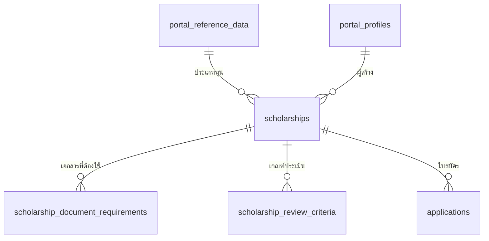
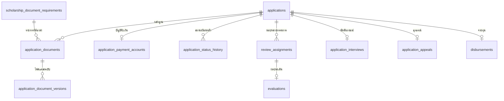
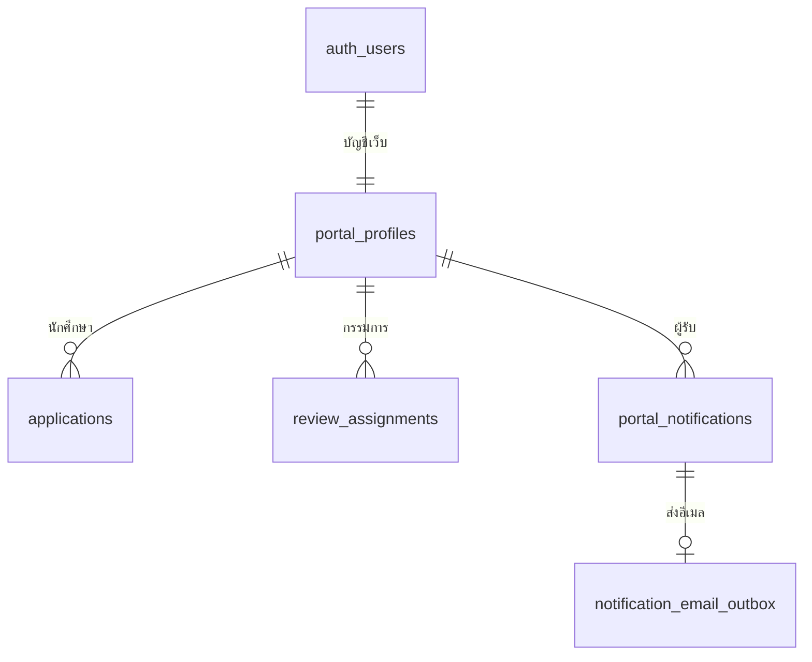

# แผนที่ฐานข้อมูลระบบทุนการศึกษา

ผังใน Supabase Schema Visualizer แสดงความสัมพันธ์ทั้งหมดของ `public` พร้อมกัน จึงมีเส้นผ่านกันหลายเส้น โดยเฉพาะ `portal_profiles` ที่ถูกอ้างถึงทั้งนักศึกษา เจ้าหน้าที่ และกรรมการ กด **Auto layout** เพื่อจัดใหม่ และใช้ **Find table** เพื่อเลื่อนไปยังตารางที่ต้องการ แผนภาพด้านล่างแยกตามงานเพื่ออ่านง่ายขึ้น

## 1. ประกาศทุนและข้อมูลกลาง

`portal_reference_data` รวมประเภททุน คณะ และสาขาที่เป็นตัวเลือกกลางอยู่แล้ว ส่วนรายการเอกสารและเกณฑ์ประเมินแยกกันเพราะหนึ่งทุนมีได้หลายรายการและมีข้อมูลคนละชนิด

## 2. ใบสมัครและการพิจารณา

`applications` เก็บสถานะปัจจุบัน ส่วน `application_status_history` เก็บลำดับเหตุการณ์ย้อนหลัง จึงไม่ควรยุบเข้าด้วยกัน `application_documents` ชี้ไฟล์ฉบับปัจจุบัน ส่วน `application_document_versions` เก็บไฟล์และผลตรวจของแต่ละฉบับ โดยไม่ใช่ตารางประวัติสถานะใบสมัคร ข้อมูลบัญชีและการจ่ายเงินแยกจากใบสมัครเพื่อจำกัดสิทธิ์การอ่าน การนัดสัมภาษณ์และอุทธรณ์เกิดคนละช่วงของงาน และผลประเมินแยกจากการมอบหมายเพื่อรองรับฉบับร่างกับสถานะกรรมการ

## 3. บัญชีและระบบสนับสนุน

`auth_users` หมายถึง `auth.users` ของ Supabase Auth ซึ่งเก็บข้อมูลเข้าระบบและรหัสผ่าน ส่วน `portal_profiles` เก็บบทบาทของเว็บ `portal_audit_log` บันทึกการเปลี่ยนแปลงแบบตรวจสอบย้อนหลัง `password_reset_rate_limits` และ `registration_rate_limits` เป็นข้อมูลภายในสำหรับจำกัดคำขอกู้รหัสผ่านและสมัครสมาชิก ไม่มีเส้น FK ไปยังข้อมูลนักศึกษาเพราะเก็บเฉพาะแฮชของอีเมล/IP

## เหตุผลที่ยังไม่รวมตารางหนึ่งต่อหนึ่ง

| คู่ตาราง | เหตุผลที่แยก |
| --- | --- |
| `applications` / `application_payment_accounts` | ข้อมูลบัญชีเป็นข้อมูลการเงินและมีสิทธิ์อ่านต่างจากใบสมัคร |
| `applications` / `application_interviews` | นัดสัมภาษณ์มีสถานะ เวลา สถานที่ และผู้สร้างเฉพาะงาน |
| `applications` / `application_appeals` | อุทธรณ์เกิดหลังประกาศผล มีสถานะและผู้พิจารณาต่างหาก |
| `review_assignments` / `evaluations` | มอบหมายได้ก่อนมีผลประเมิน และผลประเมินมีฉบับร่าง |
| `portal_notifications` / `notification_email_outbox` | แจ้งเตือนในเว็บกับคิวส่งอีเมลมีอายุและสถานะส่งต่างกัน |

การรวมคู่เหล่านี้เพื่อให้เส้นในภาพน้อยลงจะต้องแก้ RPC, RLS และการย้ายข้อมูลจริง โดยไม่ทำให้ระบบทุนเข้าใจง่ายขึ้นอย่างมีนัยสำคัญ จึงคงโครงสร้างเดิมไว้
